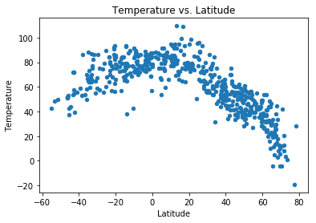
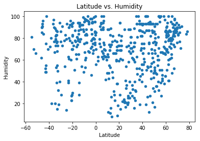
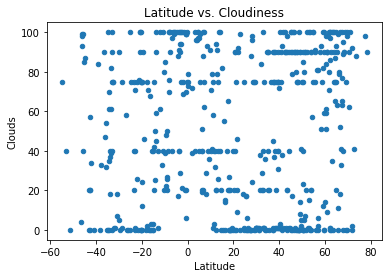
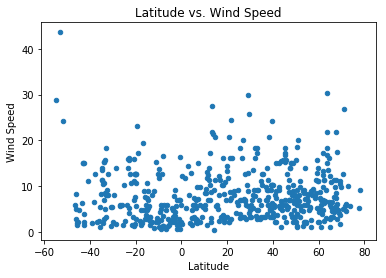

# WeatherPy

### Import Dependencies


```python
# Dependencies and Setup
import matplotlib.pyplot as plt
import pandas as pd
import numpy as np
import requests
import time
import matplotlib.pyplot as plt

# Import API key
import api_keys

# Incorporated citipy to determine city based on latitude and longitude
from citipy import citipy

# Output File (CSV)
output_data_file = "output_data/cities.csv"

# Range of latitudes and longitudes
lat_range = (-90, 90)
lng_range = (-180, 180)
```

### Generate Cities List


```python
# List for holding lat_lngs and cities
lat_lngs = []
cities = []

# Create a set of random lat and lng combinations
lats = np.random.uniform(low=-90.000, high=90.000, size=1500)
lngs = np.random.uniform(low=-180.000, high=180.000, size=1500)
lat_lngs = zip(lats, lngs)

# Identify nearest city for each lat, lng combination
for lat_lng in lat_lngs:
    city = citipy.nearest_city(lat_lng[0], lat_lng[1]).city_name
    
    # If the city is unique, then add it to a our cities list
    if city not in cities:
        cities.append(city)

# Print the city count to confirm sufficient count
len(cities)
```


    587


### Perform API Calls
* Perform a weather check on each city using a series of successive API calls.
* Include a print log of each city as it'sbeing processed (with the city number and city name).


```python
base_url = "http://api.openweathermap.org/data/2.5/weather?"

weather_df = pd.DataFrame({
    "City Name":[],
    "Country":[],
    "Latitude":[],
    "Longitude":[],
    "Date":[],
    "Temperature":[], 
    "Humidity":[],
    "Wind Speed":[],
    "Clouds":[]
})
weather_df

print("""
--------------------------------------------------------------------------------
                            Beginning Data Retrieval
--------------------------------------------------------------------------------
""")

count = 1
for i in range(len(cities)):
    try:
        query_url = f"{base_url}appid={api_keys.api_key}&q={cities[i]}&units=imperial"
        print(f"Processing Record {count} of Set 1 | {cities[i]}")
        
        response = requests.get(query_url)
        weather_json = response.json()
        
        city_country = weather_json["sys"]["country"]
        city_latitude = weather_json["coord"]["lat"]
        city_longitude = weather_json["coord"]["lon"]
        city_date = time.strftime('%Y-%m-%d', time.localtime(weather_json["dt"]))
        city_max_temperature = weather_json["main"]["temp_max"]
        city_humidity = weather_json["main"]["humidity"]
        city_windspeed = weather_json["wind"]["speed"]
        city_cloud = weather_json["clouds"]["all"]
        
        weather_df = weather_df.append({
            "City Name":cities[i],
            "Country":city_country,
            "Latitude":city_latitude,
            "Longitude":city_longitude,
            "Date":city_date,
            "Temperature":city_max_temperature, 
            "Humidity":city_humidity,
            "Wind Speed":city_windspeed,
            "Clouds":city_cloud
        }, ignore_index=True)
        
        count+=1
        
    except:
        print("Insufficient data. Skipping..")
print("""
--------------------------------------------------------------------------------
                                Data Retrieval Complete
--------------------------------------------------------------------------------
""")
```

    
    --------------------------------------------------------------------------------
                                Beginning Data Retrieval
    --------------------------------------------------------------------------------
    
    Processing Record 1 of Set 1 | new norfolk
    Processing Record 2 of Set 1 | andenes
    Insufficient data. Skipping..
    Processing Record 2 of Set 1 | ushuaia
    Processing Record 3 of Set 1 | payo
    Processing Record 4 of Set 1 | hay river
    Processing Record 5 of Set 1 | hilo
    Processing Record 6 of Set 1 | los llanos de aridane
    Processing Record 7 of Set 1 | litovko
    Processing Record 8 of Set 1 | puerto ayora
    Processing Record 9 of Set 1 | butaritari
    Processing Record 10 of Set 1 | kruisfontein
    Processing Record 11 of Set 1 | rio gallegos
    Processing Record 12 of Set 1 | port alfred
    Processing Record 13 of Set 1 | mys shmidta
    Insufficient data. Skipping..
    Processing Record 13 of Set 1 | san patricio
    Processing Record 14 of Set 1 | kuna
    Processing Record 15 of Set 1 | smithers
    Processing Record 16 of Set 1 | kalabo
    Processing Record 17 of Set 1 | mataura
    Processing Record 18 of Set 1 | albany
    Processing Record 19 of Set 1 | koungou
    Insufficient data. Skipping..
    Processing Record 19 of Set 1 | rikitea
    Processing Record 20 of Set 1 | cayenne
    Processing Record 21 of Set 1 | esperance
    Processing Record 22 of Set 1 | vila franca do campo
    Processing Record 23 of Set 1 | faanui
    Processing Record 24 of Set 1 | vao
    Processing Record 25 of Set 1 | komsomolskiy
    Processing Record 26 of Set 1 | jamestown
    Processing Record 27 of Set 1 | bambous virieux
    Processing Record 28 of Set 1 | chuy
    Processing Record 29 of Set 1 | gloversville
    Processing Record 30 of Set 1 | khatanga
    Processing Record 31 of Set 1 | suluova
    Processing Record 32 of Set 1 | saint-philippe
    Processing Record 33 of Set 1 | tuktoyaktuk
    Processing Record 34 of Set 1 | panguna
    Processing Record 35 of Set 1 | atchison
    Processing Record 36 of Set 1 | kapaa
    Processing Record 37 of Set 1 | tiksi
    Processing Record 38 of Set 1 | cape town
    Processing Record 39 of Set 1 | port elizabeth
    Processing Record 40 of Set 1 | haradok
    Processing Record 41 of Set 1 | east london
    Processing Record 42 of Set 1 | hambantota
    Processing Record 43 of Set 1 | hithadhoo
    Processing Record 44 of Set 1 | toliary
    Insufficient data. Skipping..
    Processing Record 44 of Set 1 | sao miguel
    Processing Record 45 of Set 1 | massakory
    Processing Record 46 of Set 1 | taolanaro
    Insufficient data. Skipping..
    Processing Record 46 of Set 1 | la union
    Processing Record 47 of Set 1 | marcona
    Insufficient data. Skipping..
    Processing Record 47 of Set 1 | hermanus
    Processing Record 48 of Set 1 | port hardy
    Processing Record 49 of Set 1 | santana do matos
    Processing Record 50 of Set 1 | hualmay
    Processing Record 51 of Set 1 | gat
    Processing Record 52 of Set 1 | pevek
    Processing Record 53 of Set 1 | atuona
    Processing Record 54 of Set 1 | punta arenas
    Processing Record 55 of Set 1 | barrow
    Processing Record 56 of Set 1 | mayumba
    Processing Record 57 of Set 1 | busselton
    Processing Record 58 of Set 1 | mar del plata
    Processing Record 59 of Set 1 | vaini
    Processing Record 60 of Set 1 | kaitangata
    Processing Record 61 of Set 1 | lipin bor
    Processing Record 62 of Set 1 | castro
    Processing Record 63 of Set 1 | ponta do sol
    Processing Record 64 of Set 1 | mount isa
    Processing Record 65 of Set 1 | aksarka
    Processing Record 66 of Set 1 | meulaboh
    Processing Record 67 of Set 1 | dunedin
    Processing Record 68 of Set 1 | ribeira grande
    Processing Record 69 of Set 1 | avarua
    Processing Record 70 of Set 1 | sitka
    Processing Record 71 of Set 1 | bonavista
    Processing Record 72 of Set 1 | souillac
    Processing Record 73 of Set 1 | mandalgovi
    Processing Record 74 of Set 1 | sept-iles
    Processing Record 75 of Set 1 | sao joao do paraiso
    Processing Record 76 of Set 1 | maniitsoq
    Processing Record 77 of Set 1 | zhanatas
    Insufficient data. Skipping..
    Processing Record 77 of Set 1 | san francisco
    Processing Record 78 of Set 1 | coihaique
    Processing Record 79 of Set 1 | barentsburg
    Insufficient data. Skipping..
    Processing Record 79 of Set 1 | illoqqortoormiut
    Insufficient data. Skipping..
    Processing Record 79 of Set 1 | tuy hoa
    Processing Record 80 of Set 1 | ferreira do alentejo
    Processing Record 81 of Set 1 | bluff
    Processing Record 82 of Set 1 | homer
    Processing Record 83 of Set 1 | chirongui
    Processing Record 84 of Set 1 | tasiilaq
    Processing Record 85 of Set 1 | rolla
    Processing Record 86 of Set 1 | chokurdakh
    Processing Record 87 of Set 1 | galle
    Processing Record 88 of Set 1 | asau
    Insufficient data. Skipping..
    Processing Record 88 of Set 1 | georgetown
    Processing Record 89 of Set 1 | honolulu
    Processing Record 90 of Set 1 | saltillo
    Processing Record 91 of Set 1 | bengkulu
    Insufficient data. Skipping..
    Processing Record 91 of Set 1 | hobart
    Processing Record 92 of Set 1 | cabo san lucas
    Processing Record 93 of Set 1 | satitoa
    Insufficient data. Skipping..
    Processing Record 93 of Set 1 | shelburne
    Processing Record 94 of Set 1 | along
    Processing Record 95 of Set 1 | padang
    Processing Record 96 of Set 1 | mercedes
    Processing Record 97 of Set 1 | severo-kurilsk
    Processing Record 98 of Set 1 | berlevag
    Processing Record 99 of Set 1 | xiuyan
    Processing Record 100 of Set 1 | port hedland
    Processing Record 101 of Set 1 | morondava
    Processing Record 102 of Set 1 | popesti
    Processing Record 103 of Set 1 | quesnel
    Processing Record 104 of Set 1 | broken hill
    Processing Record 105 of Set 1 | lufilufi
    Processing Record 106 of Set 1 | chapais
    Processing Record 107 of Set 1 | lebu
    Processing Record 108 of Set 1 | sovetskiy
    Processing Record 109 of Set 1 | fallon
    Processing Record 110 of Set 1 | saint george
    Processing Record 111 of Set 1 | anadyr
    Processing Record 112 of Set 1 | mahuva
    Processing Record 113 of Set 1 | hamilton
    Processing Record 114 of Set 1 | yellowknife
    Processing Record 115 of Set 1 | ahipara
    Processing Record 116 of Set 1 | fortuna
    Processing Record 117 of Set 1 | sao joao da barra
    Processing Record 118 of Set 1 | salvador
    Processing Record 119 of Set 1 | carnarvon
    Processing Record 120 of Set 1 | vonnu
    Insufficient data. Skipping..
    Processing Record 120 of Set 1 | katherine
    Processing Record 121 of Set 1 | amderma
    Insufficient data. Skipping..
    Processing Record 121 of Set 1 | grand gaube
    Processing Record 122 of Set 1 | rorvik
    Processing Record 123 of Set 1 | provideniya
    Processing Record 124 of Set 1 | srednekolymsk
    Processing Record 125 of Set 1 | qaanaaq
    Processing Record 126 of Set 1 | matara
    Processing Record 127 of Set 1 | sentyabrskiy
    Insufficient data. Skipping..
    Processing Record 127 of Set 1 | san blas
    Processing Record 128 of Set 1 | arraial do cabo
    Processing Record 129 of Set 1 | opuwo
    Processing Record 130 of Set 1 | charters towers
    Processing Record 131 of Set 1 | kodiak
    Processing Record 132 of Set 1 | pisco
    Processing Record 133 of Set 1 | moree
    Processing Record 134 of Set 1 | lorengau
    Processing Record 135 of Set 1 | chicama
    Processing Record 136 of Set 1 | bredasdorp
    Processing Record 137 of Set 1 | chateaubelair
    Processing Record 138 of Set 1 | williston
    Processing Record 139 of Set 1 | talcahuano
    Processing Record 140 of Set 1 | vestmannaeyjar
    Processing Record 141 of Set 1 | dikson
    Processing Record 142 of Set 1 | roanoke rapids
    Processing Record 143 of Set 1 | port lincoln
    Processing Record 144 of Set 1 | caravelas
    Processing Record 145 of Set 1 | grindavik
    Processing Record 146 of Set 1 | jalu
    Processing Record 147 of Set 1 | taga
    Processing Record 148 of Set 1 | turtas
    Processing Record 149 of Set 1 | ketchenery
    Insufficient data. Skipping..
    Processing Record 149 of Set 1 | tabuk
    Processing Record 150 of Set 1 | iqaluit
    Processing Record 151 of Set 1 | turbat
    Processing Record 152 of Set 1 | deputatskiy
    Processing Record 153 of Set 1 | abha
    Processing Record 154 of Set 1 | taltal
    Processing Record 155 of Set 1 | geraldton
    Processing Record 156 of Set 1 | sorong
    Processing Record 157 of Set 1 | bilma
    Processing Record 158 of Set 1 | preston
    Processing Record 159 of Set 1 | cururupu
    Processing Record 160 of Set 1 | estelle
    Processing Record 161 of Set 1 | saint-georges
    Processing Record 162 of Set 1 | luwuk
    Processing Record 163 of Set 1 | berehomet
    Processing Record 164 of Set 1 | santa isabel
    Processing Record 165 of Set 1 | picota
    Processing Record 166 of Set 1 | yangjiang
    Processing Record 167 of Set 1 | ostrovnoy
    Processing Record 168 of Set 1 | lompoc
    Processing Record 169 of Set 1 | olinda
    Processing Record 170 of Set 1 | birjand
    Processing Record 171 of Set 1 | lolua
    Insufficient data. Skipping..
    Processing Record 171 of Set 1 | batagay-alyta
    Processing Record 172 of Set 1 | mongoumba
    Processing Record 173 of Set 1 | pran buri
    Processing Record 174 of Set 1 | togur
    Processing Record 175 of Set 1 | ngukurr
    Insufficient data. Skipping..
    Processing Record 175 of Set 1 | belmonte
    Processing Record 176 of Set 1 | grand forks
    Processing Record 177 of Set 1 | saldanha
    Processing Record 178 of Set 1 | nouakchott
    Processing Record 179 of Set 1 | kamphaeng phet
    Processing Record 180 of Set 1 | kulhudhuffushi
    Processing Record 181 of Set 1 | aksu
    Processing Record 182 of Set 1 | mahebourg
    Processing Record 183 of Set 1 | berdigestyakh
    Processing Record 184 of Set 1 | konstantinovka
    Processing Record 185 of Set 1 | norman wells
    Processing Record 186 of Set 1 | otukpo
    Processing Record 187 of Set 1 | atambua
    Processing Record 188 of Set 1 | bathsheba
    Processing Record 189 of Set 1 | pyskowice
    Processing Record 190 of Set 1 | valparaiso
    Processing Record 191 of Set 1 | phan rang
    Insufficient data. Skipping..
    Processing Record 191 of Set 1 | te anau
    Processing Record 192 of Set 1 | antofagasta
    Processing Record 193 of Set 1 | srandakan
    Processing Record 194 of Set 1 | guerrero negro
    Processing Record 195 of Set 1 | katsuura
    Processing Record 196 of Set 1 | catamarca
    Insufficient data. Skipping..
    Processing Record 196 of Set 1 | nikolskoye
    Processing Record 197 of Set 1 | cavalcante
    Processing Record 198 of Set 1 | belushya guba
    Insufficient data. Skipping..
    Processing Record 198 of Set 1 | egvekinot
    Processing Record 199 of Set 1 | castlerea
    Processing Record 200 of Set 1 | cidreira
    Processing Record 201 of Set 1 | tanshui
    Insufficient data. Skipping..
    Processing Record 201 of Set 1 | adrar
    Processing Record 202 of Set 1 | samur
    Processing Record 203 of Set 1 | ust-maya
    Processing Record 204 of Set 1 | nakambala
    Processing Record 205 of Set 1 | aquiraz
    Processing Record 206 of Set 1 | faya
    Processing Record 207 of Set 1 | netivot
    Processing Record 208 of Set 1 | argelia
    Processing Record 209 of Set 1 | attawapiskat
    Insufficient data. Skipping..
    Processing Record 209 of Set 1 | cap malheureux
    Processing Record 210 of Set 1 | college
    Processing Record 211 of Set 1 | leningradskiy
    Processing Record 212 of Set 1 | rocha
    Processing Record 213 of Set 1 | argentan
    Processing Record 214 of Set 1 | eureka
    Processing Record 215 of Set 1 | tura
    Processing Record 216 of Set 1 | nova ushytsya
    Processing Record 217 of Set 1 | anyksciai
    Processing Record 218 of Set 1 | salekhard
    Processing Record 219 of Set 1 | balikpapan
    Processing Record 220 of Set 1 | the valley
    Processing Record 221 of Set 1 | victoria
    Processing Record 222 of Set 1 | isangel
    Processing Record 223 of Set 1 | constitucion
    Processing Record 224 of Set 1 | blackwater
    Processing Record 225 of Set 1 | hirara
    Processing Record 226 of Set 1 | nanortalik
    Processing Record 227 of Set 1 | porto walter
    Processing Record 228 of Set 1 | tawang
    Processing Record 229 of Set 1 | vanimo
    Processing Record 230 of Set 1 | mahanoro
    Processing Record 231 of Set 1 | yar-sale
    Processing Record 232 of Set 1 | namibe
    Processing Record 233 of Set 1 | paamiut
    Processing Record 234 of Set 1 | maragogi
    Processing Record 235 of Set 1 | opelousas
    Processing Record 236 of Set 1 | changji
    Processing Record 237 of Set 1 | airai
    Processing Record 238 of Set 1 | westport
    Processing Record 239 of Set 1 | avera
    Processing Record 240 of Set 1 | san rafael del sur
    Processing Record 241 of Set 1 | zolotinka
    Insufficient data. Skipping..
    Processing Record 241 of Set 1 | okhotsk
    Processing Record 242 of Set 1 | zhanaozen
    Processing Record 243 of Set 1 | ngunguru
    Processing Record 244 of Set 1 | suoyarvi
    Processing Record 245 of Set 1 | ardistan
    Insufficient data. Skipping..
    Processing Record 245 of Set 1 | warrensburg
    Processing Record 246 of Set 1 | fort nelson
    Processing Record 247 of Set 1 | yeppoon
    Processing Record 248 of Set 1 | saskylakh
    Processing Record 249 of Set 1 | emerald
    Processing Record 250 of Set 1 | lucea
    Processing Record 251 of Set 1 | kupang
    Processing Record 252 of Set 1 | thompson
    Processing Record 253 of Set 1 | nome
    Processing Record 254 of Set 1 | juegang
    Processing Record 255 of Set 1 | pemangkat
    Insufficient data. Skipping..
    Processing Record 255 of Set 1 | kaura namoda
    Processing Record 256 of Set 1 | beringovskiy
    Processing Record 257 of Set 1 | codo
    Processing Record 258 of Set 1 | mattawa
    Processing Record 259 of Set 1 | vardo
    Processing Record 260 of Set 1 | sabha
    Processing Record 261 of Set 1 | half moon bay
    Processing Record 262 of Set 1 | henties bay
    Processing Record 263 of Set 1 | tabas
    Processing Record 264 of Set 1 | mogadishu
    Processing Record 265 of Set 1 | pontianak
    Processing Record 266 of Set 1 | cowra
    Processing Record 267 of Set 1 | aleksandrovskoye
    Processing Record 268 of Set 1 | inuvik
    Processing Record 269 of Set 1 | luganville
    Processing Record 270 of Set 1 | tongchuan
    Processing Record 271 of Set 1 | husavik
    Processing Record 272 of Set 1 | tuatapere
    Processing Record 273 of Set 1 | nizhniy ingash
    Processing Record 274 of Set 1 | vostok
    Processing Record 275 of Set 1 | kloulklubed
    Processing Record 276 of Set 1 | yulara
    Processing Record 277 of Set 1 | deer lake
    Processing Record 278 of Set 1 | nongan
    Processing Record 279 of Set 1 | sorland
    Processing Record 280 of Set 1 | jacaleapa
    Processing Record 281 of Set 1 | buraydah
    Processing Record 282 of Set 1 | pedernales
    Processing Record 283 of Set 1 | verkhoyansk
    Processing Record 284 of Set 1 | flinders
    Processing Record 285 of Set 1 | le moule
    Processing Record 286 of Set 1 | yanan
    Insufficient data. Skipping..
    Processing Record 286 of Set 1 | poum
    Processing Record 287 of Set 1 | zhigansk
    Processing Record 288 of Set 1 | san bartolome
    Processing Record 289 of Set 1 | mudgee
    Processing Record 290 of Set 1 | leninsk
    Processing Record 291 of Set 1 | vaitupu
    Insufficient data. Skipping..
    Processing Record 291 of Set 1 | kavieng
    Processing Record 292 of Set 1 | barbar
    Insufficient data. Skipping..
    Processing Record 292 of Set 1 | buerarema
    Processing Record 293 of Set 1 | aitape
    Processing Record 294 of Set 1 | luderitz
    Processing Record 295 of Set 1 | russell
    Processing Record 296 of Set 1 | tabou
    Processing Record 297 of Set 1 | goba
    Processing Record 298 of Set 1 | dhanwar
    Processing Record 299 of Set 1 | marv dasht
    Insufficient data. Skipping..
    Processing Record 299 of Set 1 | clyde river
    Processing Record 300 of Set 1 | wanaka
    Processing Record 301 of Set 1 | kastamonu
    Processing Record 302 of Set 1 | talawdi
    Insufficient data. Skipping..
    Processing Record 302 of Set 1 | waingapu
    Processing Record 303 of Set 1 | tucuman
    Processing Record 304 of Set 1 | rio grande city
    Processing Record 305 of Set 1 | adwa
    Processing Record 306 of Set 1 | vallenar
    Processing Record 307 of Set 1 | cortez
    Processing Record 308 of Set 1 | umm kaddadah
    Processing Record 309 of Set 1 | rawson
    Processing Record 310 of Set 1 | kalawit
    Processing Record 311 of Set 1 | qiongshan
    Processing Record 312 of Set 1 | uwayl
    Insufficient data. Skipping..
    Processing Record 312 of Set 1 | warqla
    Insufficient data. Skipping..
    Processing Record 312 of Set 1 | cauquenes
    Processing Record 313 of Set 1 | tiznit
    Processing Record 314 of Set 1 | talnakh
    Processing Record 315 of Set 1 | alta floresta
    Processing Record 316 of Set 1 | tumannyy
    Insufficient data. Skipping..
    Processing Record 316 of Set 1 | phan thiet
    Processing Record 317 of Set 1 | qaqortoq
    Processing Record 318 of Set 1 | saint-pierre
    Processing Record 319 of Set 1 | khasan
    Processing Record 320 of Set 1 | acarau
    Insufficient data. Skipping..
    Processing Record 320 of Set 1 | ixtapa
    Processing Record 321 of Set 1 | port arthur
    Processing Record 322 of Set 1 | tra vinh
    Processing Record 323 of Set 1 | chenzhou
    Processing Record 324 of Set 1 | placido de castro
    Processing Record 325 of Set 1 | qujing
    Processing Record 326 of Set 1 | gaoua
    Processing Record 327 of Set 1 | bara
    Processing Record 328 of Set 1 | gambela
    Processing Record 329 of Set 1 | noumea
    Processing Record 330 of Set 1 | hasaki
    Processing Record 331 of Set 1 | brownfield
    Processing Record 332 of Set 1 | kitimat
    Processing Record 333 of Set 1 | mpraeso
    Processing Record 334 of Set 1 | laurentides
    Processing Record 335 of Set 1 | siocon
    Processing Record 336 of Set 1 | tsihombe
    Insufficient data. Skipping..
    Processing Record 336 of Set 1 | lawrenceburg
    Processing Record 337 of Set 1 | otradnoye
    Processing Record 338 of Set 1 | palmer
    Processing Record 339 of Set 1 | harper
    Processing Record 340 of Set 1 | morros
    Processing Record 341 of Set 1 | sisimiut
    Processing Record 342 of Set 1 | kommunisticheskiy
    Processing Record 343 of Set 1 | chumikan
    Processing Record 344 of Set 1 | upernavik
    Processing Record 345 of Set 1 | praya
    Processing Record 346 of Set 1 | riviere-au-renard
    Processing Record 347 of Set 1 | orotukan
    Processing Record 348 of Set 1 | muravlenko
    Processing Record 349 of Set 1 | port stanley
    Processing Record 350 of Set 1 | kariba
    Processing Record 351 of Set 1 | bethel
    Processing Record 352 of Set 1 | dzhebariki-khaya
    Processing Record 353 of Set 1 | margate
    Processing Record 354 of Set 1 | key west
    Processing Record 355 of Set 1 | sao cristovao
    Processing Record 356 of Set 1 | namtsy
    Processing Record 357 of Set 1 | scarborough
    Processing Record 358 of Set 1 | ukiah
    Processing Record 359 of Set 1 | bodden town
    Processing Record 360 of Set 1 | mount gambier
    Processing Record 361 of Set 1 | nizhnyaya tavda
    Processing Record 362 of Set 1 | zabol
    Processing Record 363 of Set 1 | viedma
    Processing Record 364 of Set 1 | torbay
    Processing Record 365 of Set 1 | puerto madryn
    Processing Record 366 of Set 1 | san cristobal
    Processing Record 367 of Set 1 | kurilsk
    Processing Record 368 of Set 1 | chibombo
    Processing Record 369 of Set 1 | solnechnyy
    Processing Record 370 of Set 1 | grand falls
    Processing Record 371 of Set 1 | itaituba
    Processing Record 372 of Set 1 | laguna
    Processing Record 373 of Set 1 | praia da vitoria
    Processing Record 374 of Set 1 | petropavlovsk-kamchatskiy
    Processing Record 375 of Set 1 | hermosillo
    Processing Record 376 of Set 1 | krasnyy chikoy
    Processing Record 377 of Set 1 | lasa
    Processing Record 378 of Set 1 | kovdor
    Processing Record 379 of Set 1 | biak
    Processing Record 380 of Set 1 | gayny
    Processing Record 381 of Set 1 | salalah
    Processing Record 382 of Set 1 | evensk
    Processing Record 383 of Set 1 | shimanovsk
    Processing Record 384 of Set 1 | longyearbyen
    Processing Record 385 of Set 1 | cherskiy
    Processing Record 386 of Set 1 | payson
    Processing Record 387 of Set 1 | portland
    Processing Record 388 of Set 1 | hami
    Processing Record 389 of Set 1 | pierre
    Processing Record 390 of Set 1 | one hundred mile house
    Insufficient data. Skipping..
    Processing Record 390 of Set 1 | novikovo
    Processing Record 391 of Set 1 | kahului
    Processing Record 392 of Set 1 | kaz
    Processing Record 393 of Set 1 | bac lieu
    Insufficient data. Skipping..
    Processing Record 393 of Set 1 | sarkand
    Processing Record 394 of Set 1 | falam
    Processing Record 395 of Set 1 | ibotirama
    Processing Record 396 of Set 1 | astana
    Processing Record 397 of Set 1 | buala
    Processing Record 398 of Set 1 | bay roberts
    Processing Record 399 of Set 1 | hofn
    Processing Record 400 of Set 1 | bakchar
    Processing Record 401 of Set 1 | akranes
    Processing Record 402 of Set 1 | karratha
    Processing Record 403 of Set 1 | hurup
    Processing Record 404 of Set 1 | kresttsy
    Processing Record 405 of Set 1 | naron
    Processing Record 406 of Set 1 | hokitika
    Processing Record 407 of Set 1 | puerto colombia
    Processing Record 408 of Set 1 | tautira
    Processing Record 409 of Set 1 | kovrov
    Processing Record 410 of Set 1 | marawi
    Processing Record 411 of Set 1 | yuancheng
    Insufficient data. Skipping..
    Processing Record 411 of Set 1 | sakakah
    Insufficient data. Skipping..
    Processing Record 411 of Set 1 | bandarbeyla
    Processing Record 412 of Set 1 | moroni
    Processing Record 413 of Set 1 | roebourne
    Processing Record 414 of Set 1 | aklavik
    Processing Record 415 of Set 1 | ponta delgada
    Processing Record 416 of Set 1 | muskogee
    Processing Record 417 of Set 1 | hof
    Processing Record 418 of Set 1 | camacha
    Processing Record 419 of Set 1 | bubaque
    Processing Record 420 of Set 1 | nampa
    Processing Record 421 of Set 1 | chagda
    Insufficient data. Skipping..
    Processing Record 421 of Set 1 | novopskov
    Processing Record 422 of Set 1 | port blair
    Processing Record 423 of Set 1 | gilazi
    Insufficient data. Skipping..
    Processing Record 423 of Set 1 | sochi
    Processing Record 424 of Set 1 | dubbo
    Processing Record 425 of Set 1 | amambai
    Processing Record 426 of Set 1 | arvika
    Processing Record 427 of Set 1 | matagalpa
    Processing Record 428 of Set 1 | san jose
    Processing Record 429 of Set 1 | carauari
    Processing Record 430 of Set 1 | mahon
    Processing Record 431 of Set 1 | broome
    Processing Record 432 of Set 1 | krasnovishersk
    Processing Record 433 of Set 1 | cotonou
    Processing Record 434 of Set 1 | fort wellington
    Processing Record 435 of Set 1 | rivera
    Processing Record 436 of Set 1 | makakilo city
    Processing Record 437 of Set 1 | wajir
    Processing Record 438 of Set 1 | manggar
    Processing Record 439 of Set 1 | pundaguitan
    Processing Record 440 of Set 1 | sorvag
    Insufficient data. Skipping..
    Processing Record 440 of Set 1 | novoagansk
    Processing Record 441 of Set 1 | ndele
    Insufficient data. Skipping..
    Processing Record 441 of Set 1 | vila velha
    Processing Record 442 of Set 1 | pangnirtung
    Processing Record 443 of Set 1 | bilibino
    Processing Record 444 of Set 1 | baft
    Processing Record 445 of Set 1 | smirnykh
    Processing Record 446 of Set 1 | burica
    Insufficient data. Skipping..
    Processing Record 446 of Set 1 | itarema
    Processing Record 447 of Set 1 | batemans bay
    Processing Record 448 of Set 1 | vidim
    Processing Record 449 of Set 1 | banda aceh
    Processing Record 450 of Set 1 | leh
    Processing Record 451 of Set 1 | butembo
    Processing Record 452 of Set 1 | nizhneyansk
    Insufficient data. Skipping..
    Processing Record 452 of Set 1 | rio cuarto
    Processing Record 453 of Set 1 | jishou
    Processing Record 454 of Set 1 | roswell
    Processing Record 455 of Set 1 | hameenlinna
    Processing Record 456 of Set 1 | coquimbo
    Processing Record 457 of Set 1 | japura
    Processing Record 458 of Set 1 | tamandare
    Processing Record 459 of Set 1 | kargopol
    Processing Record 460 of Set 1 | samalaeulu
    Insufficient data. Skipping..
    Processing Record 460 of Set 1 | uruzgan
    Processing Record 461 of Set 1 | salta
    Processing Record 462 of Set 1 | palabuhanratu
    Insufficient data. Skipping..
    Processing Record 462 of Set 1 | luanda
    Processing Record 463 of Set 1 | okato
    Processing Record 464 of Set 1 | magan
    Processing Record 465 of Set 1 | oranjestad
    Processing Record 466 of Set 1 | jaciara
    Processing Record 467 of Set 1 | san policarpo
    Processing Record 468 of Set 1 | nelson bay
    Processing Record 469 of Set 1 | nabire
    Processing Record 470 of Set 1 | bucerias
    Processing Record 471 of Set 1 | nichinan
    Processing Record 472 of Set 1 | tilichiki
    Processing Record 473 of Set 1 | nyurba
    Processing Record 474 of Set 1 | oxapampa
    Processing Record 475 of Set 1 | murgab
    Processing Record 476 of Set 1 | praia
    Processing Record 477 of Set 1 | perelyub
    Processing Record 478 of Set 1 | liverpool
    Processing Record 479 of Set 1 | santiago de cuba
    Processing Record 480 of Set 1 | urumqi
    Insufficient data. Skipping..
    Processing Record 480 of Set 1 | port keats
    Processing Record 481 of Set 1 | ankang
    Processing Record 482 of Set 1 | requena
    Processing Record 483 of Set 1 | cabedelo
    Processing Record 484 of Set 1 | coria
    Processing Record 485 of Set 1 | kabanjahe
    Processing Record 486 of Set 1 | raudeberg
    Processing Record 487 of Set 1 | alofi
    Processing Record 488 of Set 1 | luebo
    Processing Record 489 of Set 1 | turukhansk
    Processing Record 490 of Set 1 | pandan
    Processing Record 491 of Set 1 | lavrentiya
    Processing Record 492 of Set 1 | mareeba
    Processing Record 493 of Set 1 | sistranda
    Processing Record 494 of Set 1 | cockburn town
    Processing Record 495 of Set 1 | fairbanks
    Processing Record 496 of Set 1 | moose factory
    Processing Record 497 of Set 1 | delmiro gouveia
    Processing Record 498 of Set 1 | zhob
    Processing Record 499 of Set 1 | atar
    Processing Record 500 of Set 1 | champerico
    Processing Record 501 of Set 1 | kamaishi
    Processing Record 502 of Set 1 | wuwei
    Processing Record 503 of Set 1 | heihe
    Processing Record 504 of Set 1 | chara
    Processing Record 505 of Set 1 | vila
    Processing Record 506 of Set 1 | zaysan
    Processing Record 507 of Set 1 | antsirabe
    Processing Record 508 of Set 1 | nyimba
    Processing Record 509 of Set 1 | killybegs
    Processing Record 510 of Set 1 | antalaha
    Processing Record 511 of Set 1 | kavaratti
    Processing Record 512 of Set 1 | lagoa
    Processing Record 513 of Set 1 | manicore
    Processing Record 514 of Set 1 | trairi
    Processing Record 515 of Set 1 | sergeyevka
    Processing Record 516 of Set 1 | gonda
    Processing Record 517 of Set 1 | mahadday weyne
    Insufficient data. Skipping..
    Processing Record 517 of Set 1 | formosa
    Processing Record 518 of Set 1 | angoram
    Processing Record 519 of Set 1 | high river
    Processing Record 520 of Set 1 | aljezur
    Processing Record 521 of Set 1 | belle fourche
    Processing Record 522 of Set 1 | dickinson
    Processing Record 523 of Set 1 | maningrida
    Processing Record 524 of Set 1 | skalistyy
    Insufficient data. Skipping..
    Processing Record 524 of Set 1 | krasnoselkup
    Insufficient data. Skipping..
    Processing Record 524 of Set 1 | galgani
    Insufficient data. Skipping..
    Processing Record 524 of Set 1 | riyadh
    Processing Record 525 of Set 1 | araouane
    Processing Record 526 of Set 1 | ovsyanka
    Processing Record 527 of Set 1 | waycross
    Processing Record 528 of Set 1 | ninghai
    Processing Record 529 of Set 1 | lagos
    Processing Record 530 of Set 1 | vitim
    Processing Record 531 of Set 1 | byron bay
    Processing Record 532 of Set 1 | la orilla
    Processing Record 533 of Set 1 | namatanai
    Processing Record 534 of Set 1 | anakapalle
    
    --------------------------------------------------------------------------------
                                    Data Retrieval Complete
    --------------------------------------------------------------------------------
    


### Convert Raw Data to DataFrame
* Export the city data into a .csv.
* Display the DataFrame


```python
# Display the DataFrame
weather_df
```
<table border="1" class="dataframe">
  <thead>
    <tr style="text-align: right;">
      <th></th>
      <th>City Name</th>
      <th>Country</th>
      <th>Latitude</th>
      <th>Longitude</th>
      <th>Date</th>
      <th>Temperature</th>
      <th>Humidity</th>
      <th>Wind Speed</th>
      <th>Clouds</th>
    </tr>
  </thead>
  <tbody>
    <tr>
      <th>0</th>
      <td>new norfolk</td>
      <td>AU</td>
      <td>-42.78</td>
      <td>147.06</td>
      <td>2019-04-20</td>
      <td>71.60</td>
      <td>49.0</td>
      <td>14.99</td>
      <td>20.0</td>
    </tr>
    <tr>
      <th>1</th>
      <td>ushuaia</td>
      <td>AR</td>
      <td>-54.81</td>
      <td>-68.31</td>
      <td>2019-04-20</td>
      <td>42.80</td>
      <td>81.0</td>
      <td>28.86</td>
      <td>75.0</td>
    </tr>
    <tr>
      <th>2</th>
      <td>payo</td>
      <td>ID</td>
      <td>-3.75</td>
      <td>103.64</td>
      <td>2019-04-20</td>
      <td>88.82</td>
      <td>46.0</td>
      <td>3.27</td>
      <td>91.0</td>
    </tr>
    <tr>
      <th>3</th>
      <td>hay river</td>
      <td>CA</td>
      <td>60.82</td>
      <td>-115.79</td>
      <td>2019-04-20</td>
      <td>32.00</td>
      <td>91.0</td>
      <td>5.82</td>
      <td>90.0</td>
    </tr>
    <tr>
      <th>4</th>
      <td>hilo</td>
      <td>US</td>
      <td>19.71</td>
      <td>-155.08</td>
      <td>2019-04-20</td>
      <td>75.00</td>
      <td>83.0</td>
      <td>14.36</td>
      <td>40.0</td>
    </tr>
    <tr>
      <th>5</th>
      <td>los llanos de aridane</td>
      <td>ES</td>
      <td>28.66</td>
      <td>-17.92</td>
      <td>2019-04-20</td>
      <td>64.40</td>
      <td>68.0</td>
      <td>10.29</td>
      <td>75.0</td>
    </tr>
    <tr>
      <th>6</th>
      <td>litovko</td>
      <td>RU</td>
      <td>49.24</td>
      <td>135.18</td>
      <td>2019-04-20</td>
      <td>49.58</td>
      <td>34.0</td>
      <td>6.35</td>
      <td>14.0</td>
    </tr>
    <tr>
      <th>7</th>
      <td>puerto ayora</td>
      <td>EC</td>
      <td>-0.74</td>
      <td>-90.35</td>
      <td>2019-04-20</td>
      <td>78.74</td>
      <td>85.0</td>
      <td>6.91</td>
      <td>70.0</td>
    </tr>
    <tr>
      <th>8</th>
      <td>butaritari</td>
      <td>KI</td>
      <td>3.07</td>
      <td>172.79</td>
      <td>2019-04-20</td>
      <td>82.88</td>
      <td>75.0</td>
      <td>14.47</td>
      <td>100.0</td>
    </tr>
    <tr>
      <th>9</th>
      <td>kruisfontein</td>
      <td>ZA</td>
      <td>-34.00</td>
      <td>24.73</td>
      <td>2019-04-20</td>
      <td>59.84</td>
      <td>83.0</td>
      <td>10.63</td>
      <td>18.0</td>
    </tr>
    <tr>
      <th>10</th>
      <td>rio gallegos</td>
      <td>AR</td>
      <td>-51.62</td>
      <td>-69.22</td>
      <td>2019-04-20</td>
      <td>50.00</td>
      <td>66.0</td>
      <td>24.16</td>
      <td>0.0</td>
    </tr>
    <tr>
      <th>11</th>
      <td>port alfred</td>
      <td>ZA</td>
      <td>-33.59</td>
      <td>26.89</td>
      <td>2019-04-20</td>
      <td>66.00</td>
      <td>83.0</td>
      <td>5.01</td>
      <td>61.0</td>
    </tr>
    <tr>
      <th>12</th>
      <td>san patricio</td>
      <td>PY</td>
      <td>-26.98</td>
      <td>-56.83</td>
      <td>2019-04-20</td>
      <td>74.24</td>
      <td>78.0</td>
      <td>5.73</td>
      <td>58.0</td>
    </tr>
    <tr>
      <th>13</th>
      <td>kuna</td>
      <td>US</td>
      <td>43.49</td>
      <td>-116.42</td>
      <td>2019-04-20</td>
      <td>63.00</td>
      <td>87.0</td>
      <td>5.82</td>
      <td>20.0</td>
    </tr>
    <tr>
      <th>14</th>
      <td>smithers</td>
      <td>CA</td>
      <td>54.78</td>
      <td>-127.17</td>
      <td>2019-04-20</td>
      <td>39.20</td>
      <td>51.0</td>
      <td>5.82</td>
      <td>75.0</td>
    </tr>
    <tr>
      <th>15</th>
      <td>kalabo</td>
      <td>ZM</td>
      <td>-15.00</td>
      <td>22.67</td>
      <td>2019-04-20</td>
      <td>68.84</td>
      <td>79.0</td>
      <td>7.49</td>
      <td>0.0</td>
    </tr>
    <tr>
      <th>16</th>
      <td>mataura</td>
      <td>NZ</td>
      <td>-46.19</td>
      <td>168.86</td>
      <td>2019-04-20</td>
      <td>51.01</td>
      <td>90.0</td>
      <td>2.86</td>
      <td>93.0</td>
    </tr>
    <tr>
      <th>17</th>
      <td>albany</td>
      <td>US</td>
      <td>42.65</td>
      <td>-73.75</td>
      <td>2019-04-20</td>
      <td>69.80</td>
      <td>100.0</td>
      <td>9.06</td>
      <td>90.0</td>
    </tr>
    <tr>
      <th>18</th>
      <td>rikitea</td>
      <td>PF</td>
      <td>-23.12</td>
      <td>-134.97</td>
      <td>2019-04-20</td>
      <td>79.10</td>
      <td>80.0</td>
      <td>15.79</td>
      <td>71.0</td>
    </tr>
    <tr>
      <th>19</th>
      <td>cayenne</td>
      <td>GF</td>
      <td>4.94</td>
      <td>-52.33</td>
      <td>2019-04-20</td>
      <td>78.80</td>
      <td>88.0</td>
      <td>5.82</td>
      <td>97.0</td>
    </tr>
    <tr>
      <th>20</th>
      <td>esperance</td>
      <td>TT</td>
      <td>10.24</td>
      <td>-61.45</td>
      <td>2019-04-20</td>
      <td>77.00</td>
      <td>88.0</td>
      <td>5.82</td>
      <td>40.0</td>
    </tr>
    <tr>
      <th>21</th>
      <td>vila franca do campo</td>
      <td>PT</td>
      <td>37.72</td>
      <td>-25.43</td>
      <td>2019-04-20</td>
      <td>60.80</td>
      <td>87.0</td>
      <td>5.82</td>
      <td>75.0</td>
    </tr>
    <tr>
      <th>22</th>
      <td>faanui</td>
      <td>PF</td>
      <td>-16.48</td>
      <td>-151.75</td>
      <td>2019-04-20</td>
      <td>84.50</td>
      <td>72.0</td>
      <td>4.72</td>
      <td>68.0</td>
    </tr>
    <tr>
      <th>23</th>
      <td>vao</td>
      <td>EE</td>
      <td>59.10</td>
      <td>26.19</td>
      <td>2019-04-20</td>
      <td>44.18</td>
      <td>66.0</td>
      <td>5.30</td>
      <td>12.0</td>
    </tr>
    <tr>
      <th>24</th>
      <td>komsomolskiy</td>
      <td>RU</td>
      <td>67.55</td>
      <td>63.78</td>
      <td>2019-04-20</td>
      <td>29.78</td>
      <td>98.0</td>
      <td>8.48</td>
      <td>100.0</td>
    </tr>
    <tr>
      <th>25</th>
      <td>jamestown</td>
      <td>AU</td>
      <td>-33.21</td>
      <td>138.60</td>
      <td>2019-04-20</td>
      <td>87.02</td>
      <td>15.0</td>
      <td>15.68</td>
      <td>90.0</td>
    </tr>
    <tr>
      <th>26</th>
      <td>bambous virieux</td>
      <td>MU</td>
      <td>-20.34</td>
      <td>57.76</td>
      <td>2019-04-20</td>
      <td>84.20</td>
      <td>70.0</td>
      <td>12.75</td>
      <td>75.0</td>
    </tr>
    <tr>
      <th>27</th>
      <td>chuy</td>
      <td>UY</td>
      <td>-33.69</td>
      <td>-53.46</td>
      <td>2019-04-20</td>
      <td>68.66</td>
      <td>76.0</td>
      <td>15.19</td>
      <td>39.0</td>
    </tr>
    <tr>
      <th>28</th>
      <td>gloversville</td>
      <td>US</td>
      <td>43.05</td>
      <td>-74.34</td>
      <td>2019-04-20</td>
      <td>69.80</td>
      <td>100.0</td>
      <td>5.32</td>
      <td>90.0</td>
    </tr>
    <tr>
      <th>29</th>
      <td>khatanga</td>
      <td>RU</td>
      <td>71.98</td>
      <td>102.47</td>
      <td>2019-04-20</td>
      <td>8.18</td>
      <td>85.0</td>
      <td>6.06</td>
      <td>2.0</td>
    </tr>
    <tr>
      <th>...</th>
      <td>...</td>
      <td>...</td>
      <td>...</td>
      <td>...</td>
      <td>...</td>
      <td>...</td>
      <td>...</td>
      <td>...</td>
      <td>...</td>
    </tr>
    <tr>
      <th>504</th>
      <td>vila</td>
      <td>IT</td>
      <td>45.18</td>
      <td>8.40</td>
      <td>2019-04-20</td>
      <td>60.01</td>
      <td>66.0</td>
      <td>6.93</td>
      <td>0.0</td>
    </tr>
    <tr>
      <th>505</th>
      <td>zaysan</td>
      <td>KZ</td>
      <td>47.47</td>
      <td>84.87</td>
      <td>2019-04-20</td>
      <td>62.18</td>
      <td>43.0</td>
      <td>6.89</td>
      <td>80.0</td>
    </tr>
    <tr>
      <th>506</th>
      <td>antsirabe</td>
      <td>MG</td>
      <td>-19.87</td>
      <td>47.03</td>
      <td>2019-04-20</td>
      <td>65.96</td>
      <td>82.0</td>
      <td>5.59</td>
      <td>24.0</td>
    </tr>
    <tr>
      <th>507</th>
      <td>nyimba</td>
      <td>ZM</td>
      <td>-14.56</td>
      <td>30.81</td>
      <td>2019-04-20</td>
      <td>74.96</td>
      <td>65.0</td>
      <td>5.12</td>
      <td>20.0</td>
    </tr>
    <tr>
      <th>508</th>
      <td>killybegs</td>
      <td>IE</td>
      <td>54.63</td>
      <td>-8.45</td>
      <td>2019-04-20</td>
      <td>50.00</td>
      <td>95.0</td>
      <td>1.99</td>
      <td>100.0</td>
    </tr>
    <tr>
      <th>509</th>
      <td>antalaha</td>
      <td>MG</td>
      <td>-14.90</td>
      <td>50.28</td>
      <td>2019-04-20</td>
      <td>76.22</td>
      <td>84.0</td>
      <td>2.93</td>
      <td>75.0</td>
    </tr>
    <tr>
      <th>510</th>
      <td>kavaratti</td>
      <td>IN</td>
      <td>10.57</td>
      <td>72.64</td>
      <td>2019-04-20</td>
      <td>85.40</td>
      <td>63.0</td>
      <td>8.57</td>
      <td>79.0</td>
    </tr>
    <tr>
      <th>511</th>
      <td>lagoa</td>
      <td>PT</td>
      <td>37.14</td>
      <td>-8.45</td>
      <td>2019-04-20</td>
      <td>54.00</td>
      <td>87.0</td>
      <td>6.93</td>
      <td>0.0</td>
    </tr>
    <tr>
      <th>512</th>
      <td>manicore</td>
      <td>BR</td>
      <td>-5.81</td>
      <td>-61.30</td>
      <td>2019-04-20</td>
      <td>75.32</td>
      <td>95.0</td>
      <td>1.28</td>
      <td>100.0</td>
    </tr>
    <tr>
      <th>513</th>
      <td>trairi</td>
      <td>BR</td>
      <td>-3.28</td>
      <td>-39.27</td>
      <td>2019-04-20</td>
      <td>72.62</td>
      <td>98.0</td>
      <td>2.55</td>
      <td>90.0</td>
    </tr>
    <tr>
      <th>514</th>
      <td>sergeyevka</td>
      <td>KZ</td>
      <td>53.88</td>
      <td>67.42</td>
      <td>2019-04-20</td>
      <td>43.64</td>
      <td>32.0</td>
      <td>7.11</td>
      <td>0.0</td>
    </tr>
    <tr>
      <th>515</th>
      <td>gonda</td>
      <td>IN</td>
      <td>27.13</td>
      <td>81.96</td>
      <td>2019-04-20</td>
      <td>93.32</td>
      <td>20.0</td>
      <td>7.09</td>
      <td>0.0</td>
    </tr>
    <tr>
      <th>516</th>
      <td>formosa</td>
      <td>AR</td>
      <td>-26.19</td>
      <td>-58.17</td>
      <td>2019-04-20</td>
      <td>78.80</td>
      <td>83.0</td>
      <td>5.82</td>
      <td>0.0</td>
    </tr>
    <tr>
      <th>517</th>
      <td>angoram</td>
      <td>PG</td>
      <td>-4.06</td>
      <td>144.07</td>
      <td>2019-04-20</td>
      <td>85.58</td>
      <td>71.0</td>
      <td>5.30</td>
      <td>17.0</td>
    </tr>
    <tr>
      <th>518</th>
      <td>high river</td>
      <td>CA</td>
      <td>50.58</td>
      <td>-113.86</td>
      <td>2019-04-20</td>
      <td>37.40</td>
      <td>77.0</td>
      <td>6.93</td>
      <td>90.0</td>
    </tr>
    <tr>
      <th>519</th>
      <td>aljezur</td>
      <td>PT</td>
      <td>37.31</td>
      <td>-8.80</td>
      <td>2019-04-20</td>
      <td>54.00</td>
      <td>96.0</td>
      <td>4.00</td>
      <td>45.0</td>
    </tr>
    <tr>
      <th>520</th>
      <td>belle fourche</td>
      <td>US</td>
      <td>44.67</td>
      <td>-103.85</td>
      <td>2019-04-20</td>
      <td>53.01</td>
      <td>53.0</td>
      <td>3.36</td>
      <td>1.0</td>
    </tr>
    <tr>
      <th>521</th>
      <td>dickinson</td>
      <td>US</td>
      <td>46.88</td>
      <td>-102.79</td>
      <td>2019-04-20</td>
      <td>60.01</td>
      <td>54.0</td>
      <td>11.41</td>
      <td>1.0</td>
    </tr>
    <tr>
      <th>522</th>
      <td>maningrida</td>
      <td>AU</td>
      <td>-12.05</td>
      <td>134.23</td>
      <td>2019-04-20</td>
      <td>89.18</td>
      <td>54.0</td>
      <td>9.04</td>
      <td>61.0</td>
    </tr>
    <tr>
      <th>523</th>
      <td>riyadh</td>
      <td>SA</td>
      <td>24.63</td>
      <td>46.72</td>
      <td>2019-04-20</td>
      <td>84.20</td>
      <td>21.0</td>
      <td>5.82</td>
      <td>0.0</td>
    </tr>
    <tr>
      <th>524</th>
      <td>araouane</td>
      <td>ML</td>
      <td>18.90</td>
      <td>-3.53</td>
      <td>2019-04-20</td>
      <td>79.82</td>
      <td>18.0</td>
      <td>10.87</td>
      <td>0.0</td>
    </tr>
    <tr>
      <th>525</th>
      <td>ovsyanka</td>
      <td>RU</td>
      <td>53.58</td>
      <td>126.91</td>
      <td>2019-04-20</td>
      <td>43.82</td>
      <td>40.0</td>
      <td>8.43</td>
      <td>100.0</td>
    </tr>
    <tr>
      <th>526</th>
      <td>waycross</td>
      <td>US</td>
      <td>31.21</td>
      <td>-82.35</td>
      <td>2019-04-20</td>
      <td>55.40</td>
      <td>62.0</td>
      <td>8.05</td>
      <td>1.0</td>
    </tr>
    <tr>
      <th>527</th>
      <td>ninghai</td>
      <td>CN</td>
      <td>29.29</td>
      <td>121.42</td>
      <td>2019-04-20</td>
      <td>73.00</td>
      <td>88.0</td>
      <td>8.95</td>
      <td>75.0</td>
    </tr>
    <tr>
      <th>528</th>
      <td>lagos</td>
      <td>NG</td>
      <td>6.46</td>
      <td>3.39</td>
      <td>2019-04-20</td>
      <td>78.80</td>
      <td>94.0</td>
      <td>2.24</td>
      <td>20.0</td>
    </tr>
    <tr>
      <th>529</th>
      <td>vitim</td>
      <td>RU</td>
      <td>59.44</td>
      <td>112.57</td>
      <td>2019-04-20</td>
      <td>27.98</td>
      <td>77.0</td>
      <td>12.86</td>
      <td>100.0</td>
    </tr>
    <tr>
      <th>530</th>
      <td>byron bay</td>
      <td>AU</td>
      <td>-28.65</td>
      <td>153.62</td>
      <td>2019-04-20</td>
      <td>75.20</td>
      <td>73.0</td>
      <td>13.87</td>
      <td>75.0</td>
    </tr>
    <tr>
      <th>531</th>
      <td>la orilla</td>
      <td>MX</td>
      <td>18.00</td>
      <td>-102.23</td>
      <td>2019-04-20</td>
      <td>74.42</td>
      <td>77.0</td>
      <td>3.42</td>
      <td>27.0</td>
    </tr>
    <tr>
      <th>532</th>
      <td>namatanai</td>
      <td>PG</td>
      <td>-3.66</td>
      <td>152.44</td>
      <td>2019-04-20</td>
      <td>81.62</td>
      <td>78.0</td>
      <td>2.39</td>
      <td>100.0</td>
    </tr>
    <tr>
      <th>533</th>
      <td>anakapalle</td>
      <td>IN</td>
      <td>17.69</td>
      <td>83.00</td>
      <td>2019-04-20</td>
      <td>93.20</td>
      <td>59.0</td>
      <td>10.29</td>
      <td>20.0</td>
    </tr>
  </tbody>
</table>
<p>534 rows × 9 columns</p>
</div>


```python
# Export to CSV
weather_df.to_csv(r'cities.csv')
```


```python
# Describe DataFrame
weather_df.describe()
```
<table border="1" class="dataframe">
  <thead>
    <tr style="text-align: right;">
      <th></th>
      <th>Latitude</th>
      <th>Longitude</th>
      <th>Temperature</th>
      <th>Humidity</th>
      <th>Wind Speed</th>
      <th>Clouds</th>
    </tr>
  </thead>
  <tbody>
    <tr>
      <th>count</th>
      <td>534.000000</td>
      <td>534.000000</td>
      <td>534.000000</td>
      <td>534.000000</td>
      <td>534.000000</td>
      <td>534.000000</td>
    </tr>
    <tr>
      <th>mean</th>
      <td>20.594513</td>
      <td>16.068446</td>
      <td>60.392378</td>
      <td>69.601124</td>
      <td>7.915337</td>
      <td>49.833333</td>
    </tr>
    <tr>
      <th>std</th>
      <td>33.534124</td>
      <td>93.848891</td>
      <td>21.783143</td>
      <td>22.608506</td>
      <td>5.617576</td>
      <td>38.341415</td>
    </tr>
    <tr>
      <th>min</th>
      <td>-54.810000</td>
      <td>-179.170000</td>
      <td>-19.190000</td>
      <td>8.000000</td>
      <td>0.450000</td>
      <td>0.000000</td>
    </tr>
    <tr>
      <th>25%</th>
      <td>-7.915000</td>
      <td>-68.467500</td>
      <td>45.110000</td>
      <td>56.000000</td>
      <td>3.390000</td>
      <td>6.000000</td>
    </tr>
    <tr>
      <th>50%</th>
      <td>25.505000</td>
      <td>17.075000</td>
      <td>62.600000</td>
      <td>75.000000</td>
      <td>6.710000</td>
      <td>47.500000</td>
    </tr>
    <tr>
      <th>75%</th>
      <td>49.225000</td>
      <td>107.662500</td>
      <td>77.000000</td>
      <td>87.000000</td>
      <td>10.842500</td>
      <td>90.000000</td>
    </tr>
    <tr>
      <th>max</th>
      <td>78.220000</td>
      <td>179.320000</td>
      <td>109.520000</td>
      <td>100.000000</td>
      <td>43.620000</td>
      <td>100.000000</td>
    </tr>
  </tbody>
</table>
</div>


### Plotting the Data
* Use proper labeling of the plots using plot titles (including date of analysis) and axes labels.
* Save the plotted figures as .pngs.

#### Latitude vs. Temperature Plot


```python
lat_tmp_plt = weather_df.plot.scatter(x='Latitude', y='Temperature', title='Temperature vs. Latitude')

plt.savefig('Images/Temperature vs Latitude.png')
```





#### Latitude vs. Humidity Plot


```python
lat_hum_plt = weather_df.plot.scatter(x='Latitude', y='Humidity', title='Latitude vs. Humidity')

plt.savefig('Images/Latitude vs. Humidity.png')
```





#### Latitude vs. Cloudiness Plot


```python
lat_cld_plt = weather_df.plot.scatter(x='Latitude', y='Clouds', title='Latitude vs. Cloudiness')

plt.savefig('Images/Latitude vs. Cloudiness.png')
```





#### Latitude vs. Wind Speed Plot


```python
lat_wspeed_plt = weather_df.plot.scatter(x='Latitude', y='Wind Speed', title='Latitude vs. Wind Speed')

plt.savefig('Images/Latitude vs. Wind Speed.png')
```





### Three Observable Trends

#### Analysis:

* According to the Latitude vs. Temperature plot, countries with lower latitudes are hotter i.e. higher in Farenheit
    
* We observe the highest humidity levels at the Equator which has a latitude of 0 since there is a high concentration of points in the Latitude vs. Humidity scatterplot at Latitude 0.
    
* Windspeeds are highest at the higher latitudes as observed in the Latitude vs. Windspeed scatterplot. 
